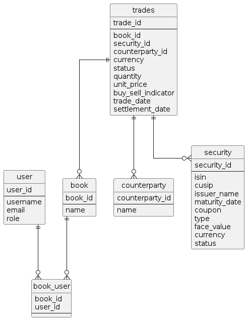

# Project Arrakis Briefing Document

## Requirements

FIC Trading Operations need to have diagnostic tools to be able to monitor inaccuracies in data then may lead to redemptions of bonds not taking place.
Currently the process of redeeming bonds is highly dependent on the quality of the instrument data and timing of system events, hence operations are monitoring books manually with a large reliance on tools such as e-mail and spreadsheets.

## High Level Ask
The FIC team would like to build an application that will allow users to track when bonds are maturing so any issues can be identified and resolved. A particular focus should be given to those bonds past maturity.

The application should at a high level:
* Allow permissioned users to see bonds that are due to mature
* Allow users to view bonds that have matured recently
* Show where almost mature bonds have been actioned by others to prevent duplication of effort and provide oversight
* (Optional) allow uses to create custom list of bonds they are tracking

Who are the users of this application?
* The users are members of the FIC ops team
* The users will manage a number of books which contain trades and have to ensure the trade bookings are correct and accurate.
* Different users are assigned different books (and therefore trades within that book) to monitor

## User Stories

| Story | Comments | Acceptance Criteria |
|-------|----------|---------------------|
| In order to view the portfolio as a user I want to see all the bonds active in the system | | All trades with status open are displayed |
| In order to support the investigation into bonds post maturity and still on the books, as a user I want to be able to view bonds due for maturity in the next 5 days | This implies within business working days | All trades with settlement date in next 5 days are displayed.  No trades with settlement date outside of the next 5 days are displayed |
| In order to provide optics on positions, as a user I want to be able to view bonds due for maturity in the last and next 5 days | | All trades with settlement date in next or previous 5 days are displayed.  No trades with settlement date outside of the next 5 days are displayed |
| In order to be able to uniquely identify a given bond and bond trades, as a user I want to see the bonds ISIN / CUSIP | ISIN - An International Securities Identification Number uniquely identifies a security. A CUSIP is a nine-digit numeric (e.g. 037833100 for Apple) or nine-character alphanumeric (e.g. 38259P508 for Google) code that identifies a North American financial security for the purposes of facilitating clearing and settlement of trades | The ISIN and/or CUSIP of a trade should be displayed.  The user should be able to search by the ISIN or CUSIP | 
| In order to identify the issuer of the bond as a user I want to see the name of the issuer of the bond | | The issuer name of a trade should be displayed.  The user should be able to search by the issuer name | 
| In order to be able to identify who owns the bond, as a user I want to see the counterparty name who holds the bond |  | The counterparty of a trade should be displayed.  The user should be able to search by the counterparty |
| In order to manage my portfolio of bonds, as a user I want to see the bonds in the books I am responsible for | This requires functionality to assign a bond to a user and then filter the data by the assigned user | The user should be able to assign bonds to themselves.  The user should be able to view only bonds assigned to them.  The user should be able to search for unassigned bonds.  The user should be able to search for bonds assigned to another user.  Once a bond is assigned to a user, another user cannot assign it to themselves.  An assigned user can unassign themselves from a bond or assign it to another user | 
| In order to understand the trading details as a user I want to be able to see the details of individual bonds | | The display should contain and be searchable by book, maturity date, trade financials, trading currency, trade/settlement date, assigned user and any other fields available in the database.  The user should be able to choose the fields to display and to reorder the alignment of the fields. All fields should be able to order the dataset |
        
## Datamodel

Example data available [here](./sample-data.md)

## What Is A Bond?
A bond is a type of investment security where an investor lends money to a company or government for a set period of time, in exchange for regular interest payments.
When the bond reaches maturity (the time when the bond issuer must repay the original bond value to the bond holder), the issuer of the bond returns the investor’s money.
** The term security is used interchangeably throughout this documentation and refers to a tradable financial instrument. **

## What is a Position?
A position is the amount of a security which is owned by an entity/person. The key features of a bond include the following:
· · ·
Face value/Par value – the amount of money the holder gets back when the bond matures
Interest/ Coupon – the amount of interest the bondholder will receive per payment, expressed as a percentage
Maturity – this date refers to the final payment date of the financial instrument at which point the original money is returned to the investor

## Managing Bond Life Cycle Events

We have to be able to track bonds in our inventory and understand when bonds mature, so that the face value can be returned to the investor.
Objectives to provide transparency on maturing bonds, in particular those bonds that are still on our books post maturity - any bond remaining on our books post maturity would indicate there is an issue with the redemption of that bond e.g. trade fail, mis-booking, systems failure to name a few.
* The FIC team would like to build an application that will allow users to track when bonds are maturing so any issues can be identified and resolved. A particular focus should be given to those bonds past maturity
* The tooling is intended to be used by operations to identify and investigate issues that would cause a bond to remain on our books post maturity allowing those issues to be addressed

## How to Approach the Project

This will be an application aids operations in identifying issues with bonds post maturity that are still on our books. The tooling should provide visibility on the trades linked to a bond which might help identify failed trades, mis-bookings, timing issues etc.

The minimal solution would entail a UI to display the redemptions due and flag redemptions past due. There should be a dashboard and search mechanism. The user should be able to run a query to view which securities are due redemption over a specific period of time. 

## Agile Approach and Incremental Feature Delivery

It is intended for the project to be delivered across a series of versions which expand over time in complexity.  Your team should choose requirements which allows the solution to grow in the delivery of requirements over time, starting with basic requirements and moving onto more advanced features.  [This article] gives a nice introduction to the approach.

### Working in Sprints

Your team should select a small number (or maybe just one) feature to be delivered within a Sprint and should aim to complete this item fully within that timebox, then move onto the next highest priority afterwards.  Try to work in a way that you have working software to demonstrate at the end of each sprint and try to avoid building all of one component at the expense of another - so don't build all the back end first with no front end to display the data.

### Working as a Team

You will need to self organise as a team, and concurrently develop parts of the solution - front end, back end, database - but these portions are dependent so you will need to collaborate and work together to get this done.  Use your version control system to share code and make sure no-one's codebase becomes isolated for a long period of time, as merging things back together and testing will be difficult.  Work in pairs to share knowledge and avoid key person dependencies.

### Evolving the Dogs API

The starting solution of the Dogs API provides enough framework to get started.  It contains a react front end, spring boot back end and an embedded database as well as the build and package system using Maven.  You should be able to evolve this by replacing code from working with dog data to working with financial data.

